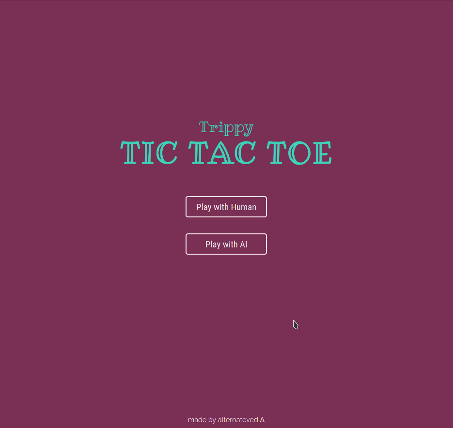

# Project: Tic Tac Toe

Implementation of Tic Tac Toe game from [The Odin Project](https://www.theodinproject.com/courses/javascript/lessons/tic-tac-toe-javascript) using **JavaScript**, **HTML** and **CSS**.

**Live preview** of the project is available [here](https://alternateved.github.io/tic-tac-toe/).

## **Features**
* You can play with another human on the same device
* You can play with **unbeatable AI**
* You can input **custom names** for players
* Live commentary for every move
* Game is **mobile responsive**
* You can restart match or start new game altogether

### **Side notes**
* Used **HTML5 semantic elements** for better structure and readability
* Learned how to use **factory functions** and **modules**
* Learned about other possible JavaScript **design patterns**
* Learned how to make layout a little bit more **animated**
* Learned how to prevent moving of page's elements with CSS
* Learned how to create a **modal**
* Applied **CSS color palette** by `:root` selector
* Learned a lot about **minimax algorithm** 

### **Tools:**
* Visual Studio Code
* Linux terminal
* Git and GitHub
* Adobe Color

### **Third party code:**
* [Google Fonts](https://fonts.google.com/)
